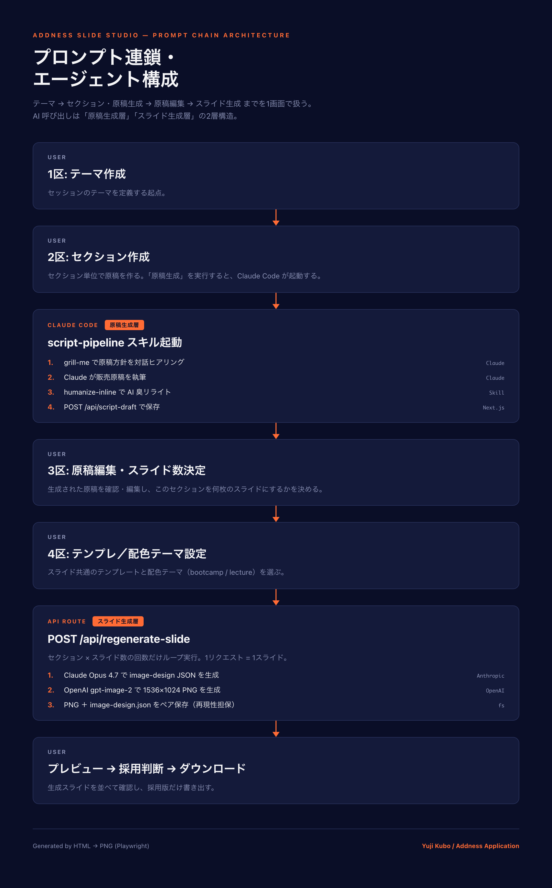

# Addness Slide Studio — デザインシステム＆ワークフロー言語化ドキュメント

提出: アドネス株式会社 採用評価タスク（CCブートキャンプ販売スライド自動生成システム）
作成者: Yuji Kubo
最終更新: 2026-05-15

---

## 冒頭サマリー

### このシステムは何か

Addness Slide Studio は、販売スライドを同じ品質で量産するための Web アプリ。1画面を4区に分け、原稿生成から PNG 出力までを通しで扱う。各区に独立した AI 連鎖が走る。アドネス株式会社の採用評価タスクとして、1週間で構築した。題材は Claude Code ブートキャンプの販売スライド。

### 設計の3点

| 階層 | こだわった判断 | 詳細 |
|---|---|---|
| 上流 | grill-me 対話でユーザーの暗黙知を吸い上げる | フォーム入力ではなく、AI が推奨案付きで1問ずつ聞く |
| 中流 | データを4層に分けて差し替え可能性を担保 | sourceDraft / extractedParts / slidePlan / slides を並列で保持 |
| 下流 | HTML→PNG の手法をドキュメントの図解にも適用 | スライド生成と同じやり方で、本書の連鎖図も作る |

### 本ドキュメントの読み方

- §4「プロンプト連鎖・エージェント構成」がシステム説明の中核。実プロンプト引用と連鎖図で中身を確認できる
- §5「こだわった点」で上流／中流／下流の判断を3点深掘り
- §6「自己評価」で採用評価5軸に沿ったセルフレビュー
- 図版（`pipeline-diagram.png`）と引用プロンプトは、すべて本システム内のコード／スキルから抜き出した実物

---

## 1. デザイン方針

本システムは「**販売スライド**」と「**制作ワークスペース**」という2つのデザイン対象を持つ。利用者も目的も違うため、方針を切り分けている。

### 1.1 スライドデザイン方針

> 可変パラメータを3軸に絞ることで再現性を担保する。

販売スライド生成で毎回 AI に自由にデザインを決めさせると、出力ごとに見た目がブレる。仕様書の必須要件「再現性（手作業の固定スライド不可、AI/AIエージェント使用必須）」を**画像生成レイヤーでも成立させる**ために、可変要素を以下の3軸に絞り、それ以外は全て固定した。

**可変3軸**

| 軸 | 入力源 | 例 |
|---|---|---|
| 文言 | 原稿から抽出される各スライドのテキスト要素 | タイトル20文字以内、サブ25文字以内、本文42文字以内×複数 |
| キャラ／イラスト | 4区で選択中のイラスト指示 | スキルプラス調人物、Clawdインスパイア8bitカニ、等 |
| カラーテーマ | bootcamp / lecture の2系統から選択 | bootcamp = ダーク+オレンジ、lecture = ホワイト+シアン |

**固定する要素**

- レイアウト（16:9、グリッドシステム、ワンフォーカルポイント）
- 余白比率（最低40%以上のホワイトスペース）
- タイポグラフィ（Inter / Noto Sans JP、Extra-Bold、影・縁取り・3D効果なし）
- 視覚規律（NO gradients / NO 3D / NO glossy effects、FLAT DESIGN + LINE ART ONLY）
- テキスト精度の絶対順位（"TEXT ACCURACY IS #1 PRIORITY"）

**配色テーマ（2系統）**

| テーマ | 背景 | 文字 | アクセント | 想定用途 |
|---|---|---|---|---|
| bootcamp | #0A0E27（ダークネイビー） | #F5F5F7（オフホワイト） | #FF6B35（ウォームオレンジ） | Claude Code 系教材、テック販売スライド |
| lecture | #FFFFFF（ホワイト） | #0F172A（ディープネイビー） | #0891B2（シアンブルー） | 講義スライド、汎用説明資料 |

アクセントカラーの適用範囲はキャンバス面積の10%以下に制限し、**ヒーローナンバーと CTA にのみ**使う。これにより「強調しすぎないが、必要な数字は確実に目に入る」状態を作る。情報商材的な装飾過多なデザインとの距離感も、ここで取っている。

### 1.2 ツールデザイン方針

> 4区1画面で、制作工程の往復コストを最小化する作業場にする。

販売スライドを量産する作業は本来「テーマ整理 → 原稿執筆 → パーツ抽出 → スライド構成 → プレビュー確認 → 出力」と工程が分かれており、それぞれが別ファイル・別アプリで扱われがち。往復コストが高い。

本ツールはこの工程を**4つの区画として1画面に並べる**ことで、ユーザーが「今どこの工程にいるか」「次に何を確認するか」を視線移動だけで完結できるようにした。

**4区の役割（左→右の進行）**

| 区 | 役割 | 主操作 |
|---|---|---|
| 1区 | テーマ作成 | テーマ・案件文脈の入力 |
| 2区 | セクション作成・原稿自動生成 | script-pipeline スキル起動の起点 |
| 3区 | 原稿編集・スライド数決定 | テキスト確認・編集、ボリューム調整 |
| 4区 | テンプレ設定・スライド生成・プレビュー・採用・ダウンロード | 最終成果物の制作と判断 |

左→右の並びを制作の流れと一致させ、**画面の動きと頭の中の流れを揃える**。

**コンポーネント方針**

- shadcn/ui ＋ Tailwind CSS ＋ Next.js（App Router）の標準スタックで統一
- スライドの bootcamp 配色を作業場 UI でも参照し、ダーク基調で目の疲れを抑える
- 4区はカードベースで区切り、左→右の処理フローを視覚的に固定

---

## 2. 構成意図

> 4つのデータレイヤーを分離することで、「差し替え可能性」を担保する。

ツールは4区の画面構成と1対1で対応するように、**内部でも4つのデータレイヤーを分けて**保持している。これは spec.md でも「v0.2 で確定した方向転換」として明記した、本システムの構成判断の核心。

### 2.1 4層データモデル

| レイヤー | 役割 | UI 上の対応 |
|---|---|---|
| `sourceDraft` | 原稿（script-pipeline スキルで生成された制作元テキスト） | 2区／3区 |
| `extractedParts` | 原稿から抽出された訴求／根拠／数字／反論／CTA／イラスト指示 | 3区 |
| `slidePlan` | どのパーツを何枚目のスライドに使うかの設計 | 3区／4区 |
| `slides` | 最終的にレンダリングへ渡すスライドJSON | 4区 |

### 2.2 なぜ「差し替え可能性」が要件か

販売スライド量産では、以下の差し替えニーズが**頻繁**に発生する。

- 同じ原稿で**配色だけ変えた別バリエ**が欲しい
- 1枚だけ気に入らないので**その1枚だけ再生成**したい
- 原稿は良いが**イラストだけ差し替え**たい
- パーツの言い回しを微修正して、**関連スライドだけ再生成**したい

これを「最終 `slides` JSON を直接編集する」設計にすると、毎回元データから再構築する必要が出て、AI呼び出しコストが重く、再現性も損なわれる。

各レイヤーを**並列に保持**しておくことで、どのレベルでの差し替えにも、**最小のAI呼び出しで対応できる**。

### 2.3 状態モデルが生む4種類の操作

| 差し替え操作 | データレイヤーの動き | AI呼び出し範囲 |
|---|---|---|
| 原稿だけ差し替え | `sourceDraft` を入れ替え | `extractedParts` 以下を再抽出 |
| パーツだけ調整 | `extractedParts` を編集 | `slidePlan` 以下を再構築 |
| 1枚だけ再生成 | `slides[N]` のみ更新 | `/api/regenerate-slide` を1回 |
| イラストだけ差し替え | `slides[N].visualPrompt` を更新 | Step 2（OpenAI）のみ実行 |

この設計により、本ツールは「**1回作って終わり**」のツールではなく、**何度も差し替えながら回す作業場**になる。仕様書の要件「再現性」を、画像生成だけでなく**ワークフローの単位でも**担保するための構成判断。

---

## 3. 使用AI／ツール

役割別に階層化したリスト。各ツールの**機能的な役割**は §4 のメイン章で詳述しているので、ここでは「何をどこで使ったか」の俯瞰のみ。

### 3.1 AI モデル

| モデル | 提供 | 用途 |
|---|---|---|
| Claude Opus 4.7 | Anthropic | スライド単位の image-design JSON 生成（販売スライド設計者ロール） |
| Claude | Anthropic | 販売原稿の対話的生成（script-pipeline スキル経由） |
| gpt-image-2 | OpenAI | image-design JSON から 1536×1024 PNG を生成 |

### 3.2 Anthropic Skills（Claude Code 内で起動）

| Skill | 役割 |
|---|---|
| `script-pipeline` | grill-me → 原稿生成 → humanize → POST までの一気通貫パイプライン |
| `grill-me` | 推奨案付きの選択肢で原稿方針をユーザーから対話的にヒアリング |
| `humanize-inline` | AI 生成テキストの「AI 臭」を診断・除去するリライト |

### 3.3 フロントエンド

- Next.js 15（App Router）
- React 19
- TypeScript 5.8
- Tailwind CSS 3.4
- shadcn/ui（@radix-ui ベース）
- lucide-react（アイコン）

### 3.4 バックエンド／API

- Next.js API Routes（`/api/regenerate-slide`, `/api/script-draft`, `/api/workspace-state-v2`, `/api/export-approved` ほか）
- `@anthropic-ai/sdk`（Claude 呼び出し）
- OpenAI Images API（`fetch` で直接呼び出し、SDK 経由ではなく軽量化）

### 3.5 永続化・ストレージ

- Supabase（サーバー側のみ、`service_role` キーで操作）
  - workspace 状態テーブル（単一行 `id = "default"` 運用）
  - Storage バケット `regenerated`（生成画像の保管）

### 3.6 ビジュアル・データ処理

- Playwright（HTML → PNG レンダリング）
  - スライド最終出力で使用
  - 本ドキュメントの連鎖図画像（`pipeline-diagram.png`）の生成にも同じ手法を再利用
- JSZip（バリエーション一括ダウンロード）

### 3.7 開発環境

- Node.js
- ESLint（コードスタイル統一）
- Vercel（デプロイターゲット）

### 3.8 設計参照（コード移植元）

- **cc-slides**：先行 CLI。`DESIGN_RULES` と `image-design.json` フォーマットの原型をここから移植
- **article-humanizer**：humanize-inline スキルのロジック源

---

## 4. プロンプト連鎖・エージェント構成

### 4.1 全体像

本システムは「**テーマ→セクション・原稿生成→原稿編集→スライド生成**」を1画面の作業場（4区）で扱うWebアプリ。AI呼び出しは2層に分かれており、それぞれが異なる役割を担う。

| 層 | 場所 | 呼び出すAI | 役割 |
|---|---|---|---|
| 原稿生成層 | 2区（Claude Code 内で script-pipeline スキル） | Claude（対話）＋humanize-inline | セクション販売原稿の対話生成と AI 臭リライト |
| スライド生成層 | 4区（Next.js API Route `/api/regenerate-slide`） | Claude Opus 4.7 ＋ OpenAI gpt-image-2 | 原稿→スライド設計JSON→画像PNGの2段変換 |



> 本図は本システムのスライド生成と同じ手法（**HTML→PNG**）で作図している。React コンポーネントで構造を書き、Playwright でブラウザレンダリングから PNG を抽出。bootcamp 配色（#0A0E27 / #F5F5F7 / #FF6B35）でスライドと世界観を統一することで、ドキュメントとシステムの設計思想が一貫していることを示す。

**参考用テキストフロー：**

```
[ユーザー] 1区でテーマ作成
   ↓
[ユーザー] 2区でセクション作成
   ↓
[Claude Code] script-pipeline スキル起動
   ① grill-me で原稿方針を対話ヒアリング
   ② Claude が販売原稿を執筆
   ③ humanize-inline で AI 臭リライト
   ④ POST /api/script-draft で保存
   ↓
[ユーザー] 3区で原稿編集・スライド数決定
   ↓
[ユーザー] 4区でテンプレ／配色設定
   ↓
[POST /api/regenerate-slide]（セクション × スライド数ループ）
   Step 1: Claude Opus 4.7 で image-design JSON 生成
   Step 2: OpenAI gpt-image-2 で 1536x1024 PNG 生成
   Step 3: PNG ＋ image-design.json 保存
   ↓
[ユーザー] プレビュー → 採用判断 → ダウンロード
```

### 4.2 原稿生成層 — script-pipeline スキル

2区で「セクション原稿を生成」を実行すると、Claude Code 上の `script-pipeline` スキルが起動する。このスキルは以下4工程を一気通貫で担う。

#### ① grill-me で原稿方針を対話ヒアリング

最初のステップは「単純なフォーム入力」ではなく、**AI からの1問ずつ推奨案付きの質問でユーザーの方針を引き出す**対話。

- ターゲット読者 / メイン訴求軸 / トーン / 構成フレーム / CTA を、選択肢付きの質問で1問ずつ決定する
- 「PASONA／Before-After／AIDA など、どの心理プロセスでなぞるか」のような上流の判断もここで詰める
- 単に値を埋めるのではなく、上流（ターゲット）→下流（CTA）の依存順で判断していく

これにより、ユーザーが頭の中に持っている**暗黙知（既存の販売観・センス）を AI に取り込む**ことが可能になる。

#### ② Claude が販売原稿を執筆

grill-me で固まった方針データを入力に、Claude が販売原稿を執筆する。

#### ③ humanize-inline で AI 臭リライト

生成された原稿は、別スキル `humanize-inline` を通じて AI 特有の言い回し（過剰な丁寧語、定型的な接続詞、抽象表現の繰り返し等）を除去する。

このスキルは別プロジェクトで開発した `article-humanizer` のロジックを移植したもので、「テキスト→humanize済みテキスト」という単純な関数として再利用できる形になっている。

#### ④ ワークスペースへ自動連携

humanize 済みの原稿は `POST /api/script-draft` 経由でワークスペースの `data/script-draft.json` に保存される。3区は同 JSON を読み込んで原稿を表示し、ユーザーが編集可能な状態にする。

### 4.3 スライド生成層 — `/api/regenerate-slide`

4区で「スライド生成」を実行すると、セクション×スライド数の回数だけ `POST /api/regenerate-slide` が叩かれる。1リクエスト=1スライドの単位で、内部は3ステップ構成。

#### Step 1: Claude Opus 4.7 で image-design JSON を生成

入力パラメータ:

```ts
{
  sectionTitle: string,      // 章タイトル
  script: string,            // 3区から渡された章原稿
  template: string,          // 選択中テンプレート名
  illustration: string,      // 選択中イラスト指示
  colorTheme: "bootcamp" | "lecture"
}
```

システムプロンプト（実装からそのまま引用、抜粋）:

```
あなたは販売スライド設計者です。
入力された原稿・テンプレ・配色・イラストを統合し、
cc-slides 形式の image-design "images[]" 配列の1要素を生成します。

# 出力フォーマット（JSON のみ、前置き禁止）
{
  "purpose": "<このスライドの役割・レイアウト指示、200字以内>",
  "text": {
    "main": "<メインタイトル、20文字以内、結論文型、説明文型禁止>",
    "sub":  "<サブタイトル、25文字以内>",
    "other": ["<本文行1、42文字以内>", "<本文行2>", "<本文行3>"]
  }
}

# 事実準拠ルール
入力原稿の事実のみ使用する。以下は禁止：
- 情景描写、感情・心情、人物・関係、属性・性格、
  時系列の詳細、動機・思考、主観評価、派生フレーズ

# 数字の混同を絶対にしない
- 「達成チーム4人」と「会社の人数」は別物（会社は100名体制）
- 「初月売上4,500万円」の「初月」を消さない
- 「営業初月1,000万円の案件」（単価）と
  「初月売上4,500万円」（総売上）を混同しない

# title のキレ味
- 結論文または体言止め
- 「、」が2つ以上は説明文 → 書き直す
- 要素列挙禁止
```

このプロンプトの設計意図:

- **JSON 出力縛り**で後段の処理を決定論的にする（パース失敗を 1 段で検知できる）
- **事実準拠ルール**で「AI が原稿にない情景や感情を盛る」事故を構造的に防ぐ
- **数字混同禁止**は販売スライドの致命傷を直接潰すルール（金額・人数の取り違えはクレーム直結）
- **title のキレ味**ルールはセールスコピーの基本（説明文型をテーマで弾く）

#### Step 2: OpenAI gpt-image-2 で画像生成

Step 1 の image-design JSON を、cc-slides から移植した共通 DESIGN_RULES と STRICT COLOR PALETTE と組み合わせて画像生成プロンプトを構築する。

DESIGN_RULES（実装からそのまま引用、抜粋）:

```
=== ABSOLUTE RULES ===
- TEXT ACCURACY IS #1 PRIORITY.
  Copy every character EXACTLY from "TEXT TO RENDER".
- NEVER use emoji anywhere on the image.
- Render ONLY the listed text. Do NOT add extra labels or numbers.
- ALL Japanese text must be perfectly legible.

=== ILLUSTRATION STYLE ===
- FLAT DESIGN + LINE ART ONLY.
  NO 3D, isometric, glossy, or realistic rendering.

=== TYPOGRAPHY ===
- CLEAN TYPOGRAPHY ONLY.
  No outlines, shadows, strokes, or 3D effects.

=== LAYOUT ===
- Strict GRID system. Generous margins (10%+ each side).
- ONE clear focal point per image.
- Whitespace is a design element — at least 40% empty space.

=== VISUAL DISCIPLINE ===
- NO decorative gradients, curves, swooshes, or wave shapes.
- NO rounded rectangle cards, pill badges,
  button shapes, or card grids with shadows.
- Think "Apple keynote slide" — minimal, grid-aligned, breathable.
```

STRICT COLOR PALETTE（bootcamp テーマ抜粋）:

```
- background  #0A0E27 (dark navy)
- main text   #F5F5F7 (off-white)
- accent      #FF6B35 (warm orange)
- Orange accent applied ONLY to hero numbers and CTA elements
- Keep accent area under 10% of total canvas
```

このプロンプト設計の意図:

- **DESIGN_RULES を生成プロンプトに直接埋め込む**ことで、画像生成モデルにスタイルガードレールを毎回明示する
- **配色を STRICT に絞り**、画像モデルに「自由演出」をさせない
- 結果として、**入力（原稿）が変わっても見た目のブレが起きない**＝採用評価軸の「再現性」を画像生成レイヤーでも担保

#### Step 3: PNG ＋ image-design.json を保存

生成画像は `public/regenerated/<timestamp>/slide-1.png` に PNG として保存。あわせて、生成に使った image-design.json も同ディレクトリに保存し、**設計図と実画像のペアを残す**ことで後からの再現と検証を可能にする。

### 4.4 連鎖の設計判断（なぜこの形か）

このパイプラインの構造は以下の判断で決まっている。

| 判断 | 理由 |
|---|---|
| 原稿生成を grill-me 対話型にした | フォーム入力では「販売観」「センス」が取り込めない。AIが1問ずつ推奨案を出して人間に選ばせる形のほうが、暗黙知を構造化データに変換しやすい |
| humanize-inline を独立スキル化した | 原稿生成と AI 臭リライトを分けることで、リライトロジックを他プロジェクト（article 系）と共有可能にした |
| スライド生成で Claude → OpenAI の2段にした | Claude に「設計判断（何を伝えるか）」を、OpenAI に「描画（どう見せるか）」を分業させ、それぞれの強みに張った |
| DESIGN_RULES を共通定数として固定した | 配色やレイアウトを毎回 AI に判断させると揺れる。**ルールを定数化＋STRICT 化することで、可変は文言とイラストとカラーテーマの3軸のみ**になる |
| image-design.json を必ず保存する | 設計図を後から差し替えて再レンダーできる構造にすることで、画像をやり直したい時にもAI呼び出しを最小化できる |

---

## 5. こだわった点

設計判断のうち、特に推したい3点を**上流／中流／下流**から1つずつ選んだ。

### 5.1 【上流】grill-me 対話で暗黙知を AI に取り込む

通常、AI にスライドを作らせる仕組みでは、ターゲット・訴求軸・トーンを**フォームで入力**するのが定石。しかしこの方式には致命的な弱点がある。

ユーザーが頭の中に持っている販売観・センスは、フォームの選択肢では汲み取れない。「副業会社員向け」と書いても、その奥にある「副業30代×伸び悩み×情報商材警戒」という具体的な像はフォームには収まらない。

本システムは原稿生成の最初のステップを `grill-me` スキルに任せ、AIが**1問ずつ推奨案付きで質問する対話**で、ターゲット → メイン訴求 → トーン → 構成フレーム → CTA を順に決めていく。

これにより：

- ユーザーは「選ぶ」だけでよい（=ハードルが低い）
- AI からの推奨案が「自分の中に既にあった判断」を引き出すきっかけになる
- 上流（ターゲット）→下流（CTA）の依存順で詰めるので、判断のブレが起きない

販売スライドの品質は「上流の判断」で決まる。フォームではなく対話にしたことで、**自動化しつつ、人間の暗黙知も逃さない**入口設計になった。

### 5.2 【中流】4つのデータレイヤー分離で「差し替え可能性」を担保

§2 で触れた通り、本ツールは内部で `sourceDraft / extractedParts / slidePlan / slides` の4層を**並列に保持**している。

通常のスライド生成ツールは「最終 JSON だけを編集する」設計が多い。しかしそれだと、配色だけ変えたい／1枚だけ再生成したい／原稿だけ差し替えたい、というニーズが来るたびに**全部再生成**する必要が出る。AI 呼び出しコストが重く、再現性も損なわれる。

本システムは中間状態を全部保持する設計にした。結果として：

- 配色テーマだけ変更 → カラーパラメータだけ差し替え（AI 呼び出しゼロ）
- 1枚だけ再生成 → `/api/regenerate-slide` を1回だけ
- 原稿差し替え → `sourceDraft` から下流を再抽出

「**1回作って終わり**」のツールから「**何度も差し替えながら回す作業場**」に昇格させた判断。販売スライド量産という実業務を見据えた構成。

### 5.3 【下流】HTML→PNG 思想の一貫性

スライド生成の最後の工程は「Claude/OpenAI が返す JSON → HTML 組み立て → Playwright で PNG 化」という流れ。

本ドキュメント②の連鎖図画像（`pipeline-diagram.png`）も、**同じ手法で生成**している。React コンポーネントとして連鎖図を書き、Playwright でPNG化した。

これにより：

- ドキュメント② と スライド63枚 が**同じ配色（bootcamp）・同じ手法**で生成されている
- 「HTML→PNG こそ本システムの芯」という設計思想が、ドキュメントを開いた瞬間に伝わる
- ツール内部で確立した「再現性のあるビジュアル生成」を、提出資料そのものに適用した実例になっている

技術的な一貫性は、口頭の説明より雄弁。**手段と成果物が同じ材料でできていること**を見せることで、設計者の妥協のなさを示した。

---

## 6. 自己評価

採用評価5軸（AI活用力／スピード／クオリティ／センス／コミュニケーション）に沿って、自分の作業を「**できたこと**」「**まだ甘いこと**」「**次に伸ばす点**」の3視点で評価する。

### 6.1 AI活用力

| 観点 | 評価 |
|---|---|
| できたこと | プロンプト連鎖を2層（原稿生成層・スライド生成層）に分け、各層を独立したスキル／API として実装。Claude × OpenAI の役割分業、DESIGN_RULES の定数化、grill-me 対話の組み込み、humanize-inline の分離など、AI を「使う」のではなく「設計する」レベルで組み立てた |
| 甘いこと | プロンプトの回帰テスト（出力品質の自動検証）が未整備。プロンプトを変更したときに既存スライドの再現性が崩れないかを保証する仕組みがない |
| 次に伸ばす点 | プロンプトのバージョン管理＋スナップショットテストの仕組み化。プロンプト変更を「実験」として扱えるようにする |

### 6.2 スピード

| 観点 | 評価 |
|---|---|
| できたこと | 1週間の期限内に、設計→実装→提出ドキュメントの言語化までを通した。途中で構成を v0.1 → v0.2 に切り替える方向転換も含めて消化できた |
| 甘いこと | 実装の途中状態が残っている部分がある（4区 UI の細部、複数バリエの完全生成など）。MVP の境界を最初に絞り切れず、終盤に時間を圧縮した |
| 次に伸ばす点 | 最初に「**何を作らないか**」を強く決める。MVP を狭く取り、余った時間でドキュメントとデモ動画の質を上げる配分にする |

### 6.3 クオリティ

| 観点 | 評価 |
|---|---|
| できたこと | DESIGN_RULES の STRICT 化、image-design.json と PNG のペア保存、4層データレイヤーの分離など、再現性と差し替え可能性を担保する設計を貫いた |
| 甘いこと | エラーハンドリング・失敗時のリカバリ・ログ可視化が薄い。AI 呼び出しが落ちたときのリトライ／代替フローが未整備 |
| 次に伸ばす点 | 失敗ケースのフロー設計（リトライ・代替モデル・部分結果保存）と、ログのダッシュボード化 |

### 6.4 センス

| 観点 | 評価 |
|---|---|
| できたこと | bootcamp 配色の確立、可変パラメータ3軸への絞り込み、情報商材臭との距離感の取り方、HTML→PNG 思想をドキュメントの図解にも適用した一貫性 |
| 甘いこと | lecture テーマでの実バリエ生成と、別商材での適用テストが未完了。bootcamp 配色での見え方しか検証していない |
| 次に伸ばす点 | lecture テーマの実バリエ生成、別商材（講義スライド・別カテゴリ商材）での適用テストを通して、デザインシステムの汎用性を確認 |

### 6.5 コミュニケーション

| 観点 | 評価 |
|---|---|
| できたこと | 本ドキュメント②を「なぜこの設計にしたか」まで言語化し、10ページ以上にまとめた。設計判断と実装のペアを表で見せる構造にした |
| 甘いこと | アドネスのオープンチャットでの質問頻度が低かった。判断に詰まった箇所を独力で消化した結果、外部との接点が薄くなった |
| 次に伸ばす点 | 詰まった判断は「**言語化して外に出す**」を習慣化。質問のタイミングと粒度を意識的に増やす |

---

## 付録

### A. リポジトリ／提出物リンク

- スライド画像 3バリエ: (GitHubリポジトリURL)
- コード: (GitHubリポジトリURL)
- デモURL: (Vercel URL)
- デモ動画: (Loom URL)
